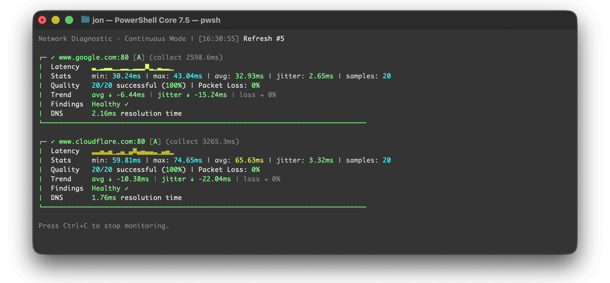
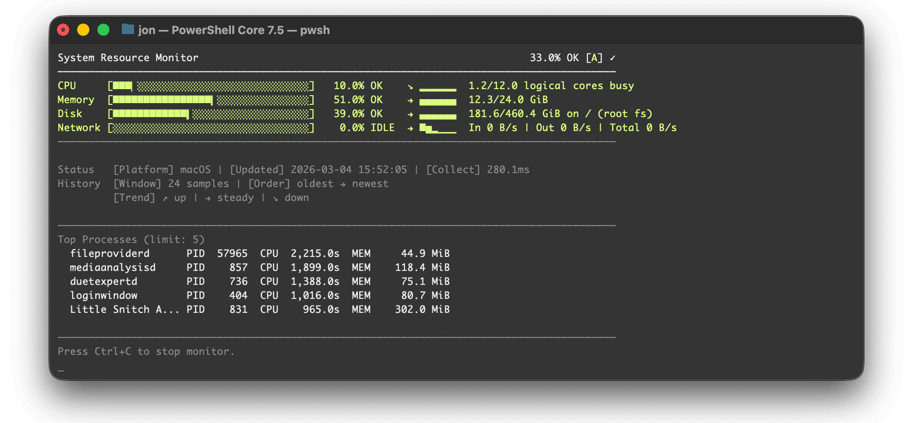
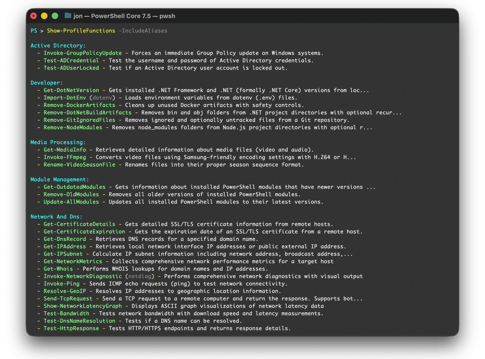

# PowerShell Profile

[](https://github.com/jonlabelle/pwsh-profile/actions/workflows/ci.yml)

> A modern, cross-platform PowerShell profile with auto-loading utility functions for network testing, system administration, and developer workflows.

## Screenshots

### Invoke-NetworkDiagnostic

```powershell
'www.google.com', 'www.cloudflare.com', 'jonlabelle.com', 'microsoft.com' |
    Invoke-NetworkDiagnostic -Port 80 -Continuous -Interval 2 -SampleDelayMilliseconds 50 -IncludeDns
```



Runs network and DNS checks for multiple hosts, then renders live latency graphs.

---

### Show-SystemResourceMonitor

```powershell
Show-SystemResourceMonitor -Continuous -IncludeTopProcesses
```



Displays a live system monitor for CPU, memory, disk, and network activity plus top processes by resource consumption.

---

### Show-ProfileFunctions

```powershell
Show-ProfileFunctions -IncludeAliases
```



Lists available profile functions with their aliases.

---

## Features

- **Cross-platform compatibility** - Works on Windows, macOS, and Linux
- **Auto-loading functions** - All functions in the [`Functions`](./Functions/) directory are auto-loaded with your profile
- **Local functions support** - Add your own functions to [`Functions/Local`](./Functions/Local/)
- **Custom prompt** - Clean, colored PowerShell prompt

## Table of Contents

- [Screenshots](#screenshots)
- [Features](#features)
- [Prerequisites](#prerequisites)
- [Install](#install)
- [Troubleshooting](#troubleshooting)
- [Update](#update)
- [Quick Start](#quick-start)
- [Local Functions](#local-functions)
- [Remote Sessions](#remote-sessions)
- [Functions](#functions)
  - [Network and DNS](#network-and-dns)
  - [System Administration](#system-administration)
  - [Developer](#developer)
  - [Security](#security)
  - [Active Directory](#active-directory)
  - [PowerShell Module Management](#powershell-module-management)
  - [Profile Management](#profile-management)
  - [Media Processing](#media-processing)
  - [Utilities](#utilities)
- [Using Functions Standalone](#using-functions-standalone)
- [Contributing](#contributing)
- [Author](#author)
- [License](#license)

## Prerequisites

- PowerShell Desktop 5.1+ or PowerShell 6+ (`pwsh`)
- Internet access for install/update checks and remote documentation links
- `git` (optional, but recommended for `Update-Profile` and `Test-ProfileUpdate`)

## Install

Use the provided [install.ps1](install.ps1) script to automate backups (during install), preserve your existing `Functions/Local`, `Help`, `Modules`, `PSReadLine`, and `Scripts` directories, and deploy the latest profile files. The script works on PowerShell Desktop 5.1 and PowerShell Core 6+.

> [!Note]
> **Git is optional:** If Git is available, the script clones the repository. Otherwise, it automatically downloads and extracts the repository as a zip file from GitHub.

### Quick Install (one-liner)

> The script is downloaded and piped directly into PowerShell. If you prefer to [inspect](install.ps1) it first, [download](https://raw.githubusercontent.com/jonlabelle/pwsh-profile/refs/heads/main/install.ps1) it to disk and run it via `-File`.

#### PowerShell Core (pwsh)

```powershell
irm 'https://raw.githubusercontent.com/jonlabelle/pwsh-profile/main/install.ps1' |
    pwsh -NoProfile -ExecutionPolicy Bypass -
```

#### Windows PowerShell Desktop 5.1 (powershell)

```powershell
irm 'https://raw.githubusercontent.com/jonlabelle/pwsh-profile/main/install.ps1' |
    powershell -NoProfile -ExecutionPolicy Bypass -
```

### Alternative Install Methods

<details>
<summary><strong>Run install.ps1 Locally</strong></summary>

#### Run install.ps1 Locally

If you already cloned [this repository](https://github.com/jonlabelle/pwsh-profile) (or downloaded [install.ps1](install.ps1)), run it from the repo root:

```bash
pwsh -NoProfile -ExecutionPolicy Bypass -File ./install.ps1
```

---

</details>

<details>
<summary><strong>Optional Install Parameters</strong></summary>

#### Optional Parameters

- `-SkipBackup` — Install without creating a backup of your current profile directory. Only applies to install, not restore.
- `-BackupPath <path>` — When restoring, save a backup of your current profile before restoring from the backup. By default, restore does not create a backup.
- `-SkipPreserveDirectories` — Do not restore the `Functions/Local`, `Help`, `Modules`, `PSReadLine`, and `Scripts` directories after installation.
- `-PreserveDirectories @('Dir1','Dir2')` — Only restore the directories you specify.
- `-LocalSourcePath <path>` — Copy profile files from a local directory instead of cloning from Git.
- `-ProfileRoot <path>` — Use a custom profile directory instead of the default.

For more examples, see the [install.ps1](install.ps1) script documentation.

---

</details>

<details>
<summary><strong>Restore from a Backup</strong></summary>

#### Restore from a Backup

You can restore your profile from a previous backup created by the install script. When you restore, the script does not create a new backup of your current profile unless you ask for one.

**Restore from a backup (no new backup is made):**

```powershell
irm 'https://raw.githubusercontent.com/jonlabelle/pwsh-profile/main/install.ps1' |
    pwsh -NoProfile -ExecutionPolicy Bypass - -RestorePath 'C:\Users\you\Documents\WindowsPowerShell-backup-20251116-110000'
```

**Restore and save a backup of your current profile before restoring:**

```powershell
irm 'https://raw.githubusercontent.com/jonlabelle/pwsh-profile/main/install.ps1' |
    pwsh -NoProfile -ExecutionPolicy Bypass - -RestorePath 'C:\Users\you\Documents\WindowsPowerShell-backup-20251116-110000' -BackupPath 'C:\Users\you\Documents\WindowsPowerShell-backup-pre-restore'
```

---

</details>

<details>
<summary><strong>Manual Install (fallback)</strong></summary>

#### Manual Install (fallback)

> **Strongly Recommended:** Use [install.ps1](install.ps1) instead of manually cloning the repository. The install script provides automatic backups, preserves your local directories (`Help`, `Modules`, `PSReadLine`, `Scripts`), and includes easy restoration capabilities that manual installation does not.

If you still prefer to install manually, you can clone this repository directly into your profile directory:

```powershell
# Resolve profile directory
$profileDir = Split-Path -Path $PROFILE -Parent

# Backup existing profile directory
if (Test-Path -Path $profileDir) {
    $backupPath = "$profileDir-backup-$(Get-Date -Format 'yyyyMMdd-HHmmss')"
    Move-Item -Path $profileDir -Destination $backupPath
    Write-Host "Existing profile backed up to: $backupPath" -ForegroundColor Yellow
}

# Clone the repository into the profile directory
git clone 'https://github.com/jonlabelle/pwsh-profile.git' --depth 1 $profileDir
```

**To restore from a manual backup:**

```powershell
# Remove the new installation
Remove-Item -Path $profileDir -Recurse -Force

# Restore from backup (replace the timestamp with your actual backup)
Move-Item -Path "$profileDir-backup-20250118-120000" -Destination $profileDir
```

**Recommended:** Use [install.ps1](install.ps1) with the `-RestorePath` parameter for safe restoration. If you want to keep a copy of your current profile before restoring, add the `-BackupPath` option.

---

</details>

## Troubleshooting

<details>
<summary><strong>Execution Policy Error (Windows Only)</strong></summary>

### Execution Policy Error (Windows Only)

> **Note:** Execution policies are **only enforced on Windows**. macOS and Linux systems do not enforce execution policies and will not encounter this error.

If you encounter an error like this when PowerShell starts on **Windows**:

```console
Microsoft.PowerShell_profile.ps1 cannot be loaded because running
scripts is disabled on this system.

For more information, see about_Execution_Policies at
https:/go.microsoft.com/fwlink/?LinkID=135170.
```

This means your system's execution policy is preventing the profile from loading. To fix this, open a PowerShell window (no administrator privileges required) and execute:

```powershell
Set-ExecutionPolicy -ExecutionPolicy RemoteSigned -Scope CurrentUser
```

This sets the execution policy for your user account only, allowing locally created scripts to run while still requiring downloaded scripts to be signed. **No administrator privileges are required** for the `CurrentUser` scope.

**Alternative (requires administrator privileges):** To set the execution policy for all users on the computer, run PowerShell as Administrator and execute:

```powershell
Set-ExecutionPolicy -ExecutionPolicy RemoteSigned -Scope LocalMachine
```

Note: The `CurrentUser` scope takes precedence over `LocalMachine`, so setting it for your user is usually sufficient.

**Verification:** After setting the execution policy, restart PowerShell. Your profile should load without errors.

For more information about execution policies, see [about_Execution_Policies](https://learn.microsoft.com/en-us/powershell/module/microsoft.powershell.core/about/about_execution_policies).

---

</details>

<details>
<summary><strong>Enable Verbose Logging for Troubleshooting</strong></summary>

### Enable Verbose Logging for Troubleshooting

If you're experiencing issues with the profile loading or want to see which functions are being loaded, you can enable verbose logging. Since the profile [immediately starts loading functions](https://github.com/jonlabelle/pwsh-profile/blob/main/Microsoft.PowerShell_profile.ps1#L3) when it runs, you need to set the verbose preference **before** PowerShell loads the profile.

#### Option 1: Start PowerShell with Verbose Output

Launch PowerShell with the `-Verbose` parameter (not available in all PowerShell hosts):

```powershell
# PowerShell Core (pwsh)
pwsh -NoLogo -Command "`$VerbosePreference = 'Continue'; . `$PROFILE"

# Windows PowerShell Desktop (powershell)
powershell -NoLogo -Command "`$VerbosePreference = 'Continue'; . `$PROFILE"
```

#### Option 2: Temporarily Enable Verbose Preference

Start PowerShell with `-NoProfile`, then manually set the verbose preference and load the profile:

```powershell
# Start without profile
pwsh -NoProfile

# Enable verbose output
$VerbosePreference = 'Continue'

# Manually load the profile
. $PROFILE

# Reset verbose preference when done (optional)
$VerbosePreference = 'SilentlyContinue'
```

#### What You'll See

When verbose logging is enabled, you'll see output like:

```console
VERBOSE: Loading function: /Users/username/.config/powershell/Functions/Developer/Get-DotNetVersion.ps1
VERBOSE: Loading function: /Users/username/.config/powershell/Functions/Developer/Import-DotEnv.ps1
VERBOSE: Creating 'dotenv' alias for Import-DotEnv
VERBOSE: Loading function: /Users/username/.config/powershell/Functions/Developer/Remove-DotNetBuildArtifacts.ps1
VERBOSE: Loading function: /Users/username/.config/powershell/Functions/Security/ConvertFrom-JwtToken.ps1
...
VERBOSE: User profile loaded:
VERBOSE: /Users/username/.config/powershell/Microsoft.PowerShell_profile.ps1
```

This shows each function file being dot-sourced, which is helpful for:

- Identifying which function file is causing errors
- Verifying all functions are being loaded
- Debugging function loading order issues
- Confirming the profile path and location

#### For Individual Functions

All functions in this profile include their own verbose logging. After the profile loads, you can use the `-Verbose` parameter on individual functions:

```powershell
# See verbose output from a specific function
Get-WhichCommand git -Verbose
Test-Port localhost -Port 80 -Verbose
```

---

</details>

## Update

To pull in the latest updates from the repository (`git` required):

```powershell
Update-Profile
```

After updating, restart PowerShell to reload your profile.

You can check for available updates without applying them (`git` required):

```powershell
Test-ProfileUpdate
```

If `git` is unavailable, rerun the install command from the [Install](#install) section to fetch the latest files.

## Quick Start

After installation, try these commands to explore what the profile offers:

```powershell
# View all available functions
Show-ProfileFunctions

# Test network connectivity to a host and port
Test-Port bing.com -Port 443

# Get your public IP with geolocation
Get-IPAddress -Public

# Check DNS resolution
Test-DnsNameResolution github.com

# Get SSL certificate expiration
Get-CertificateExpiration github.com
```

Or dig deeper with a more complex example:

```console
# Perform comprehensive network diagnostics on multiple hosts
PS > Invoke-NetworkDiagnostic 'bing.com', 'microsoft.com'

┌─ bing.com:443 (collect 2584.9ms)
│  Latency: ▂▂▃▄▄▅▆▅▆▅▄▄▇▅▇▇█▅▅▁
│  Stats  : min: 27.35ms | max: 36.26ms | avg: 32.1ms | jitter: 2ms | samples: 20
│  Quality: 20/20 successful (100%) | Packet Loss: 0%
│  Findings: Healthy
└───────────────────────────────────────────────────────────────────────────────

┌─ microsoft.com:443 (collect 2586ms)
│  Latency: ▁▁▂▄▄▅▆▄▇▄▄▃▇▆███▅▆▁
│  Stats  : min: 28.68ms | max: 35ms | avg: 32.08ms | jitter: 2ms | samples: 20
│  Quality: 20/20 successful (100%) | Packet Loss: 0%
│  Findings: Healthy
└───────────────────────────────────────────────────────────────────────────────
```

Explore the full list of functions in the [Functions](#functions) section below.

## Local Functions

The [`Functions/Local`](./Functions/Local/) directory is available for your **machine-local functions** that you don't want to commit to the repository. This is perfect for:

- Work-specific utilities
- Personal helper functions
- Experimental functions you're testing
- Machine-specific automations

Any PowerShell file placed in `Functions/Local` will be automatically loaded, just like the built-in functions. The entire directory is git-ignored, so your local functions are never accidentally committed and remain completely untouched when you run `Update-Profile` to pull the latest changes.

> See the [local functions README](Functions/Local/README.md) for detailed instructions, templates, and examples.

## Remote Sessions

<details>
<summary><strong>PowerShell profiles don't load automatically in remote sessions—click to see how to load them</strong></summary>

### Loading Profiles in Remote Sessions

PowerShell profiles don't load automatically in remote sessions (via `Enter-PSSession`, `New-PSSession`, or `Invoke-Command`). This behavior is consistent across all platforms—Windows, macOS, and Linux—whether you're using WinRM (Windows-only) or SSH-based remoting (cross-platform).

> **Note:** SSH-based remoting requires PowerShell 6+ and SSH to be installed on both local and remote computers. For setup instructions, see [PowerShell remoting over SSH](https://learn.microsoft.com/en-us/powershell/scripting/security/remoting/ssh-remoting-in-powershell).

To use your profile functions in a remote session, you have two options:

### Load Your Local Profile in the Remote Session

Use `Invoke-Command` to run your local profile script on the remote computer:

```powershell
$session = New-PSSession -HostName RemoteHost -UserName YourUser
Invoke-Command -Session $session -FilePath $PROFILE
```

### Load the Remote Computer's Profile

Dot-source the profile on the remote computer using its explicit path:

```powershell
$session = New-PSSession -HostName RemoteHost -UserName YourUser
Invoke-Command -Session $session -ScriptBlock {
    . "$HOME/.config/powershell/Microsoft.PowerShell_profile.ps1"
}
```

After running either command, the profile's functions and aliases will be available in `$session`.

For example, to use a profile function in the remote session:

```powershell
# Use a function from the loaded profile
Invoke-Command -Session $session -ScriptBlock { Test-Port -ComputerName bing.com -Port 443 }

# Or enter the session interactively
Enter-PSSession $session
# Now you can use profile functions directly
Test-DnsNameResolution example.com
Exit-PSSession
```

> **Note:** For Windows PowerShell Desktop 5.1, replace `.config/powershell` with `Documents\WindowsPowerShell` in the path.

For more information, see Microsoft's documentation on [Profiles and Remote Sessions](https://learn.microsoft.com/en-us/powershell/module/microsoft.powershell.core/about/about_profiles#profiles-and-remote-sessions).

---

</details>

## Functions

The profile includes utility functions organized by category:

### Network and DNS

- **[`Get-DnsRecord`](Functions/NetworkAndDns/Get-DnsRecord.ps1)** — Retrieves DNS records for any record type using DNS-over-HTTPS
- **[`Get-IPAddress`](Functions/NetworkAndDns/Get-IPAddress.ps1)** — Gets local network interface IPs or public IP address with geolocation data
- **[`Get-IPSubnet`](Functions/NetworkAndDns/Get-IPSubnet.ps1)** — Calculates IP subnet information including network/broadcast addresses
- **[`Get-NetworkMetrics`](Functions/NetworkAndDns/Get-NetworkMetrics.ps1)** — Collects comprehensive network performance metrics
- **[`Get-Whois`](Functions/NetworkAndDns/Get-Whois.ps1)** — Performs WHOIS lookups for domain names with registration details and nameservers
- **[`Invoke-NetworkDiagnostic`](Functions/NetworkAndDns/Invoke-NetworkDiagnostic.ps1)** — Performs network diagnostics with visual graphs
- **[`Invoke-Ping`](Functions/NetworkAndDns/Invoke-Ping.ps1)** — Sends ICMP echo requests with detailed statistics (cross-platform ping alternative)
- **[`Resolve-GeoIP`](Functions/NetworkAndDns/Resolve-GeoIP.ps1)** — Resolves IP addresses to geographic locations
- **[`Send-TcpRequest`](Functions/NetworkAndDns/Send-TcpRequest.ps1)** — Sends TCP requests and retrieves responses for network testing
- **[`Show-NetworkLatencyGraph`](Functions/NetworkAndDns/Show-NetworkLatencyGraph.ps1)** — Displays network latency visualization graphs
- **[`Test-Bandwidth`](Functions/NetworkAndDns/Test-Bandwidth.ps1)** — Tests network bandwidth with download speed and latency measurements
- **[`Test-DnsNameResolution`](Functions/NetworkAndDns/Test-DnsNameResolution.ps1)** — Tests DNS name resolution using cross-platform .NET methods
- **[`Test-HttpResponse`](Functions/NetworkAndDns/Test-HttpResponse.ps1)** — Tests HTTP/HTTPS endpoints and returns response details
- **[`Test-Port`](Functions/NetworkAndDns/Test-Port.ps1)** — Tests TCP/UDP port connectivity with detailed connection information
- **[`Test-TlsProtocol`](Functions/NetworkAndDns/Test-TlsProtocol.ps1)** — Tests which TLS protocols (1.0, 1.1, 1.2, 1.3) are supported by remote servers

### System Administration

- **[`Invoke-ElevatedCommand`](Functions/SystemAdministration/Invoke-ElevatedCommand.ps1)** — Executes commands with elevated privileges (Run as Administrator)
- **[`Set-TlsSecurityProtocol`](Functions/SystemAdministration/Set-TlsSecurityProtocol.ps1)** — Configures TLS security protocol settings for secure network connections
- **[`Show-SystemResourceMonitor`](Functions/SystemAdministration/Show-SystemResourceMonitor.ps1)** — Displays a visual monitor for CPU, memory, disk, and network activity
- **[`Start-KeepAlive`](Functions/SystemAdministration/Start-KeepAlive.ps1)** — Prevents the system and display from sleeping
- **[`Test-Admin`](Functions/SystemAdministration/Test-Admin.ps1)** — Checks if the current PowerShell session is running as administrator/root/sudo
- **[`Test-PendingReboot`](Functions/SystemAdministration/Test-PendingReboot.ps1)** — Checks if the system has pending reboot requirements
- **[`Get-SystemInfo`](Functions/SystemAdministration/Get-SystemInfo.ps1)** — Gets system information from local or remote computers

### Developer

- **[`Get-DotNetVersion`](Functions/Developer/Get-DotNetVersion.ps1)** — Retrieves installed .NET Framework and .NET Core versions
- **[`Import-DotEnv`](Functions/Developer/Import-DotEnv.ps1)** — Loads environment variables from dotenv (.env) files
- **[`Invoke-GitPull`](Functions/Developer/Invoke-GitPull.ps1)** — Performs bulk `git pull` operations across multiple repositories
- **[`Remove-DotNetBuildArtifacts`](Functions/Developer/Remove-DotNetBuildArtifacts.ps1)** — Cleans up .NET build artifacts from a project directory
- **[`Remove-GitIgnoredFiles`](Functions/Developer/Remove-GitIgnoredFiles.ps1)** — Removes ignored and optionally untracked files from Git repositories
- **[`Remove-NodeModules`](Functions/Developer/Remove-NodeModules.ps1)** — Removes node_modules folders from Node.js project directories
- **[`Remove-DockerArtifacts`](Functions/Developer/Remove-DockerArtifacts.ps1)** — Prunes unused Docker images/networks/cache/containers/volumes

### Security

- **[`ConvertFrom-JwtToken`](Functions/Security/ConvertFrom-JwtToken.ps1)** — Decodes a JWT (JSON Web Token) and returns its header and payload
- **[`Get-CertificateDetails`](Functions/Security/Get-CertificateDetails.ps1)** — Retrieves detailed SSL/TLS certificate information from remote hosts or cert files
- **[`Get-CertificateExpiration`](Functions/Security/Get-CertificateExpiration.ps1)** — Gets SSL/TLS certificate expiration dates from remote hosts or cert files
- **[`Protect-PathWithPassword`](Functions/Security/Protect-PathWithPassword.ps1)** — Encrypts files or folders with AES-256 encryption using a password
- **[`Unprotect-PathWithPassword`](Functions/Security/Unprotect-PathWithPassword.ps1)** — Decrypts files that were encrypted with Protect-PathWithPassword

### Active Directory

- **[`Invoke-GroupPolicyUpdate`](Functions/ActiveDirectory/Invoke-GroupPolicyUpdate.ps1)** — Forces an immediate Group Policy update on Windows systems
- **[`Test-ADCredential`](Functions/ActiveDirectory/Test-ADCredential.ps1)** — Validates Active Directory user credentials
- **[`Test-ADUserLocked`](Functions/ActiveDirectory/Test-ADUserLocked.ps1)** — Tests if an Active Directory user account is locked out

### PowerShell Module Management

- **[`Get-OutdatedModules`](Functions/ModuleManagement/Get-OutdatedModules.ps1)** — Checks if any installed PowerShell modules have newer versions available
- **[`Remove-OldModules`](Functions/ModuleManagement/Remove-OldModules.ps1)** — Removes older versions of installed PowerShell modules
- **[`Update-AllModules`](Functions/ModuleManagement/Update-AllModules.ps1)** — Updates all PowerShell modules to the latest versions

### Profile Management

- **[`Show-ProfileFunctions`](Functions/ProfileManagement/Show-ProfileFunctions.ps1)** — Shows all functions available in this PowerShell profile
- **[`Test-ProfileUpdate`](Functions/ProfileManagement/Test-ProfileUpdate.ps1)** — Checks for available profile updates from the GitHub repository
- **[`Update-Profile`](Functions/ProfileManagement/Update-Profile.ps1)** — Updates the profile to the latest version from the configured Git repository

### Media Processing

- **[`Get-MediaInfo`](Functions/MediaProcessing/Get-MediaInfo.ps1)** — Retrieves comprehensive media file metadata (video and audio) using ffprobe
- **[`Invoke-FFmpeg`](Functions/MediaProcessing/Invoke-FFmpeg.ps1)** — Converts video files using Samsung TV-friendly H.264/H.265 encoding
- **[`Rename-VideoSeasonFile`](Functions/MediaProcessing/Rename-VideoSeasonFile.ps1)** — Batch renames TV show episode files to a consistent format

### Utilities

- **[`Convert-LineEndings`](Functions/Utilities/Convert-LineEndings.ps1)** — Converts line endings between Unix and Windows
- **[`ConvertFrom-Base64`](Functions/Utilities/ConvertFrom-Base64.ps1)** — Decodes Base64-encoded strings or files with URL-safe support
- **[`ConvertTo-Base64`](Functions/Utilities/ConvertTo-Base64.ps1)** — Encodes strings or files to Base64 with URL-safe support
- **[`Copy-Directory`](Functions/Utilities/Copy-Directory.ps1)** — Copies directories recursively while excluding specific directories
- **[`Extract-Archives`](Functions/Utilities/Extract-Archives.ps1)** — Finds all archives (zip, tar, 7z, rar) and extracts them
- **[`Get-CommandAlias`](Functions/Utilities/Get-CommandAlias.ps1)** — Displays aliases for PowerShell cmdlets
- **[`Get-StringHash`](Functions/Utilities/Get-StringHash.ps1)** — Computes hash values for strings (like `Get-FileHash` but for strings)
- **[`Get-WhichCommand`](Functions/Utilities/Get-WhichCommand.ps1)** — Locates commands and displays their type or path (cross-platform which alternative)
- **[`New-SymbolicLink`](Functions/Utilities/New-SymbolicLink.ps1)** — Creates symbolic links (symlinks) for files and directories
- **[`Remove-SymbolicLink`](Functions/Utilities/Remove-SymbolicLink.ps1)** — Removes symbolic links (symlinks) for files and directories
- **[`New-RandomString`](Functions/Utilities/New-RandomString.ps1)** — Generates random strings for passwords, tokens, and other uses
- **[`Remove-OldFiles`](Functions/Utilities/Remove-OldFiles.ps1)** — Removes files older than a specified time period with optional empty directory cleanup
- **[`Rename-File`](Functions/Utilities/Rename-File.ps1)** — Renames files with advanced transformations
- **[`Replace-StringInFile`](Functions/Utilities/Replace-StringInFile.ps1)** — Finds and replaces text in files with support for regex and backups
- **[`Search-FileContent`](Functions/Utilities/Search-FileContent.ps1)** — Searches files with regex, context, filtering, and colorized output
- **[`Sync-Directory`](Functions/Utilities/Sync-Directory.ps1)** — Synchronizes directories using native platform tools (rsync/robocopy)
- **[`Format-Bytes`](Functions/Utilities/Format-Bytes.ps1)** — Formats bytes/bits into human-friendly conversions

## Using Functions Standalone

Functions can be used without loading the profile by dot-sourcing them directly:

```powershell
# Load a specific function (any dependencies are auto-loaded)
. '~/.config/powershell/Functions/NetworkAndDns/Test-Port.ps1'

# Use it
Test-Port bing.com -Port 443
```

> **Path note:** On Windows PowerShell Desktop 5.1, use `~/Documents/WindowsPowerShell/Functions/...` instead of `~/.config/powershell/Functions/...`.

> Functions with dependencies automatically load what they need, so you only need to dot-source the function you want to use.

## Contributing

Contributions are welcome! Please follow these guidelines:

- One function per file in `Functions/{Category}` (named `Verb-Noun.ps1`) — auto-loaded by the main profile
- Include Pester tests for new functions — both unit and integration tests where applicable (see [`Tests/README.md`](Tests/README.md) for test structure and examples)
- Open a [pull request](https://github.com/jonlabelle/pwsh-profile/pulls) with a clear description and basic verification steps (linting + functional testing)
- Maintain cross-platform compatibility following the project's conventions (see [`./Functions`](./Functions/) for examples)

## Author

[@jonlabelle](https://github.com/jonlabelle)

## License

[MIT License](LICENSE)
