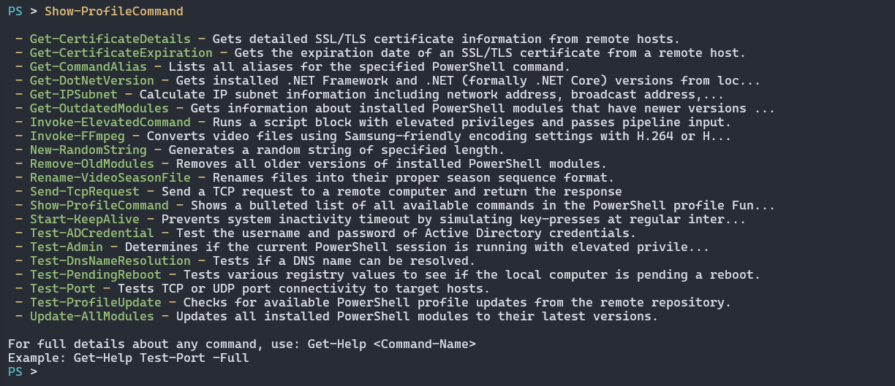

# PowerShell Profile

[](https://github.com/jonlabelle/pwsh-profile/actions/workflows/ci.yml)

> Cross-platform PowerShell profile with auto-loading utility functions for network testing, system administration, and developer workflows.

## Features

- **Cross-platform compatibility** - Works on Windows, macOS, and Linux
- **Auto-loading functions** - All functions in the [`Functions/`](./Functions/) directory are auto-loaded with your profile
- **Local functions support** - Add your own functions to [`Functions/Local/`](./Functions/Local/)
- **Custom prompt** - Clean, colored PowerShell prompt

## Screenshot



## Table of Contents

- [Install](#install)
- [Update](#update)
- [Troubleshooting](#troubleshooting)
- [Functions](#functions)
  - [Network and DNS](#network-and-dns)
  - [System Administration](#system-administration)
  - [Developer](#developer)
  - [Security](#security)
  - [Active Directory](#active-directory)
  - [PowerShell Module Management](#powershell-module-management)
  - [Profile Management](#profile-management)
  - [Media Processing](#media-processing)
  - [Utilities](#utilities)
- [Local Functions](#local-functions)
- [Contributing](#contributing)
- [Author](#author)
- [License](#license)

## Install

Use the provided [install.ps1](install.ps1) script to automate backups, preserve your existing `Functions/Local`, `Help`, `Modules`, `PSReadLine`, and `Scripts` directories, and deploy the latest profile files. The script works on PowerShell Desktop 5.1 and PowerShell Core 6+.

> [!Note] > **Git is optional:** If Git is available, the script clones the repository. Otherwise, it automatically downloads and extracts the repository as a zip file from GitHub.

### Quick Install (one-liner)

> The script is downloaded and piped directly into PowerShell. If you prefer to [inspect it](install.ps1) first, [download it to disk](https://raw.githubusercontent.com/jonlabelle/pwsh-profile/refs/heads/main/install.ps1) and run it via `-File`.

#### PowerShell Core (pwsh)

```powershell
irm 'https://raw.githubusercontent.com/jonlabelle/pwsh-profile/main/install.ps1' |
    pwsh -NoProfile -ExecutionPolicy Bypass -
```

#### Windows PowerShell Desktop 5.1 (powershell)

```powershell
irm 'https://raw.githubusercontent.com/jonlabelle/pwsh-profile/main/install.ps1' |
    powershell -NoProfile -ExecutionPolicy Bypass -
```

### Run install.ps1 Locally

If you already cloned [this repository](https://github.com/jonlabelle/pwsh-profile) (or downloaded [install.ps1](install.ps1)), run it from the repo root:

```bash
pwsh -NoProfile -ExecutionPolicy Bypass -File ./install.ps1
```

### Restore from a Backup

`install.ps1` can restore a previous snapshot created during installation. Provide the full path to the backup directory (for example, `C:\Users\you\Documents\WindowsPowerShell-backup-20251116-110000`).

```powershell
irm 'https://raw.githubusercontent.com/jonlabelle/pwsh-profile/main/install.ps1' |
    pwsh -NoProfile -ExecutionPolicy Bypass - -RestorePath 'C:\Users\you\Documents\WindowsPowerShell-backup-20251116-110000'
```

### Optional Parameters

- `-SkipBackup` — install without creating a backup of the existing profile directory
- `-SkipPreserveDirectories` — do not restore the `Functions/Local`, `Help`, `Modules`, `PSReadLine`, and `Scripts` directories after installation
- `-PreserveDirectories @('Dir1','Dir2')` — override the default directories that are restored
- `-LocalSourcePath <path>` — copy profile files from an existing local clone instead of running `git clone`
- `-ProfileRoot <path>` — override the detected profile directory (defaults to `Split-Path -Parent $PROFILE`)

For more examples, see the [install.ps1](install.ps1) script documentation.

### Manual Install (fallback)

If you prefer to install manually, clone this repository directly into your profile directory.

#### Linux/macOS

```powershell
git clone 'https://github.com/jonlabelle/pwsh-profile.git' "$HOME/.config/powershell"
```

#### Windows PowerShell Desktop 5.1

```powershell
git clone 'https://github.com/jonlabelle/pwsh-profile.git' "$HOME\Documents\WindowsPowerShell"
```

#### Windows PowerShell Core

```powershell
git clone 'https://github.com/jonlabelle/pwsh-profile.git' "$HOME\Documents\PowerShell"
```

## Update

To pull in the latest updates from the repository:

```powershell
Update-Profile
```

You can check for available updates without applying them:

```powershell
Test-ProfileUpdate
```

## Troubleshooting

<details>
<summary><strong>Execution Policy Error</strong></summary>

If you encounter an error like this when PowerShell starts:

```console
Microsoft.PowerShell_profile.ps1 cannot be loaded because running
scripts is disabled on this system.

For more information, see about_Execution_Policies at
https:/go.microsoft.com/fwlink/?LinkID=135170.
```

This means your system's execution policy is preventing the profile from loading. To fix this, run PowerShell as Administrator and execute:

```powershell
Set-ExecutionPolicy -ExecutionPolicy RemoteSigned -Scope CurrentUser
```

This allows locally created scripts to run while still requiring downloaded scripts to be signed. For more restrictive environments where you can't change the execution policy, you may need to contact your system administrator.

**Alternative:** If you can't run as Administrator, try setting the policy for just your user:

```powershell
Set-ExecutionPolicy -ExecutionPolicy RemoteSigned -Scope CurrentUser -Force
```

**Verification:** After setting the execution policy, restart PowerShell. Your profile should load without errors.

For more information about execution policies, see [about_Execution_Policies](https://learn.microsoft.com/en-us/powershell/module/microsoft.powershell.core/about/about_execution_policies).

</details>

## Functions

The profile includes utility functions organized by category:

### Network and DNS

- **[`Get-CertificateExpiration`](Functions/NetworkAndDns/Get-CertificateExpiration.ps1)** — Gets SSL/TLS certificate expiration dates from remote hosts
- **[`Get-CertificateDetails`](Functions/NetworkAndDns/Get-CertificateDetails.ps1)** — Retrieves detailed SSL/TLS certificate information from remote hosts
- **[`Get-DnsRecord`](Functions/NetworkAndDns/Get-DnsRecord.ps1)** — Retrieves DNS records for any record type using DNS-over-HTTPS
- **[`Get-IPAddress`](Functions/NetworkAndDns/Get-IPAddress.ps1)** — Gets local network interface IPs or public IP address with geolocation data
- **[`Get-Whois`](Functions/NetworkAndDns/Get-Whois.ps1)** — Performs WHOIS lookups for domain names with registration details and nameservers
- **[`Invoke-Ping`](Functions/NetworkAndDns/Invoke-Ping.ps1)** — Sends ICMP echo requests with detailed statistics (cross-platform ping alternative)
- **[`Resolve-GeoIP`](Functions/NetworkAndDns/Resolve-GeoIP.ps1)** — Resolves IP addresses to geographic locations
- **[`Send-TcpRequest`](Functions/NetworkAndDns/Send-TcpRequest.ps1)** — Sends TCP requests and retrieves responses for network testing
- **[`Test-Bandwidth`](Functions/NetworkAndDns/Test-Bandwidth.ps1)** — Tests network bandwidth with download speed and latency measurements
- **[`Test-DnsNameResolution`](Functions/NetworkAndDns/Test-DnsNameResolution.ps1)** — Tests DNS name resolution using cross-platform .NET methods
- **[`Test-HttpResponse`](Functions/NetworkAndDns/Test-HttpResponse.ps1)** — Tests HTTP/HTTPS endpoints and returns response details
- **[`Test-Port`](Functions/NetworkAndDns/Test-Port.ps1)** — Tests TCP/UDP port connectivity with detailed connection information

### System Administration

- **[`Invoke-ElevatedCommand`](Functions/SystemAdministration/Invoke-ElevatedCommand.ps1)** — Executes commands with elevated privileges (Run as Administrator)
- **[`Set-TlsSecurityProtocol`](Functions/SystemAdministration/Set-TlsSecurityProtocol.ps1)** — Configures TLS security protocol settings for secure network connections
- **[`Start-KeepAlive`](Functions/SystemAdministration/Start-KeepAlive.ps1)** — Prevents the system and display from sleeping
- **[`Test-Admin`](Functions/SystemAdministration/Test-Admin.ps1)** — Checks if the current PowerShell session is running as administrator/root/sudo
- **[`Test-PendingReboot`](Functions/SystemAdministration/Test-PendingReboot.ps1)** — Checks if the system has pending reboot requirements
- **[`Get-SystemInfo`](Functions/SystemAdministration/Get-SystemInfo.ps1)** — Gets basic system information from local or remote computers

### Developer

- **[`Get-DotNetVersion`](Functions/Developer/Get-DotNetVersion.ps1)** — Retrieves installed .NET Framework and .NET Core versions
- **[`Remove-DotNetBuildArtifacts`](Functions/Developer/Remove-DotNetBuildArtifacts.ps1)** — Cleans up .NET build artifacts from a project directory
- **[`Remove-GitIgnoredFiles`](Functions/Developer/Remove-GitIgnoredFiles.ps1)** — Removes ignored and optionally untracked files from Git repositories
- **[`Remove-NodeModules`](Functions/Developer/Remove-NodeModules.ps1)** — Removes node_modules folders from Node.js project directories

### Security

- **[`ConvertFrom-JwtToken`](Functions/Security/ConvertFrom-JwtToken.ps1)** — Decodes a JWT (JSON Web Token) and returns its header and payload
- **[`Protect-PathWithPassword`](Functions/Security/Protect-PathWithPassword.ps1)** — Encrypts files or folders with AES-256 encryption using a password
- **[`Unprotect-PathWithPassword`](Functions/Security/Unprotect-PathWithPassword.ps1)** — Decrypts files that were encrypted with Protect-PathWithPassword

### Active Directory

- **[`Invoke-GroupPolicyUpdate`](Functions/ActiveDirectory/Invoke-GroupPolicyUpdate.ps1)** — Forces an immediate Group Policy update on Windows systems
- **[`Test-ADCredential`](Functions/ActiveDirectory/Test-ADCredential.ps1)** — Validates Active Directory user credentials
- **[`Test-ADUserLocked`](Functions/ActiveDirectory/Test-ADUserLocked.ps1)** — Tests if an Active Directory user account is locked out

### PowerShell Module Management

- **[`Get-OutdatedModules`](Functions/ModuleManagement/Get-OutdatedModules.ps1)** — Checks if any installed PowerShell modules have newer versions available
- **[`Remove-OldModules`](Functions/ModuleManagement/Remove-OldModules.ps1)** — Removes older versions of installed PowerShell modules
- **[`Update-AllModules`](Functions/ModuleManagement/Update-AllModules.ps1)** — Updates all PowerShell modules to the latest versions

### Profile Management

- **[`Show-ProfileFunctions`](Functions/ProfileManagement/Show-ProfileFunctions.ps1)** — Shows all functions available in this PowerShell profile
- **[`Test-ProfileUpdate`](Functions/ProfileManagement/Test-ProfileUpdate.ps1)** — Checks for available profile updates from the GitHub repository

### Media Processing

- **[`Invoke-FFmpeg`](Functions/MediaProcessing/Invoke-FFmpeg.ps1)** — Converts video files using Samsung TV-friendly H.264/H.265 encoding
- **[`Rename-VideoSeasonFile`](Functions/MediaProcessing/Rename-VideoSeasonFile.ps1)** — Batch renames TV show episode files to a consistent format

### Utilities

- **[`Convert-LineEndings`](Functions/Utilities/Convert-LineEndings.ps1)** — Converts line endings between Unix and Windows
- **[`Copy-DirectoryWithExclusions`](Functions/Utilities/Copy-DirectoryWithExclusions.ps1)** — Copies directories recursively while excluding specific directories
- **[`Get-CommandAlias`](Functions/Utilities/Get-CommandAlias.ps1)** — Displays aliases for PowerShell cmdlets
- **[`Get-IPSubnet`](Functions/Utilities/Get-IPSubnet.ps1)** — Calculates IP subnet information including network/broadcast addresses
- **[`Get-StringHash`](Functions/Utilities/Get-StringHash.ps1)** — Computes hash values for strings (like `Get-FileHash` but for strings)
- **[`Get-WhichCommand`](Functions/Utilities/Get-WhichCommand.ps1)** — Locates commands and displays their type or path (cross-platform which alternative)
- **[`New-RandomString`](Functions/Utilities/New-RandomString.ps1)** — Generates random strings for passwords, tokens, and other uses
- **[`Remove-OldFiles`](Functions/Utilities/Remove-OldFiles.ps1)** — Removes files older than a specified time period with optional empty directory cleanup
- **[`Replace-StringInFile`](Functions/Utilities/Replace-StringInFile.ps1)** — Finds and replaces text in files with support for regex and backups
- **[`Search-FileContent`](Functions/Utilities/Search-FileContent.ps1)** — Search files with regex, context, filtering, and colorized output
- **[`Sync-Directory`](Functions/Utilities/Sync-Directory.ps1)** — Synchronizes directories using native platform tools (rsync/robocopy)

## Local Functions

The [`Functions/Local/`](./Functions/Local/) directory is available for your **machine-local functions** that you don't want to commit to the repository. This is perfect for:

- Work-specific utilities
- Personal helper functions
- Experimental functions you're testing
- Machine-specific automations

Any PowerShell file placed in `Functions/Local/` will be automatically loaded, just like the built-in functions. The entire directory is git-ignored, so your local functions are never accidentally committed and remain completely untouched when you run `Update-Profile` to pull the latest changes.

> See the [local functions README](Functions/Local/README.md) for detailed instructions, templates, and examples.

## Contributing

Contributions are welcome! Please follow these guidelines:

- One function per file in `Functions/` (named `Verb-Noun.ps1`) — auto-loaded by the main profile
- Open a [pull request](https://github.com/jonlabelle/pwsh-profile/pulls) with a clear description and basic verification steps (linting + functional testing)
- Maintain cross-platform compatibility following the project's conventions (see [`./Functions`](./Functions/) for examples)

## Author

[@jonlabelle](https://github.com/jonlabelle)

## License

[MIT License](LICENSE)
