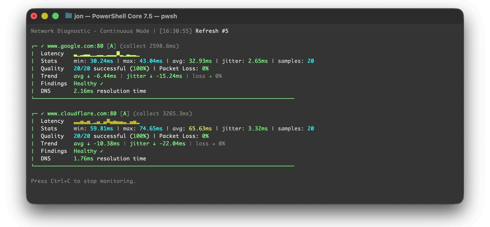
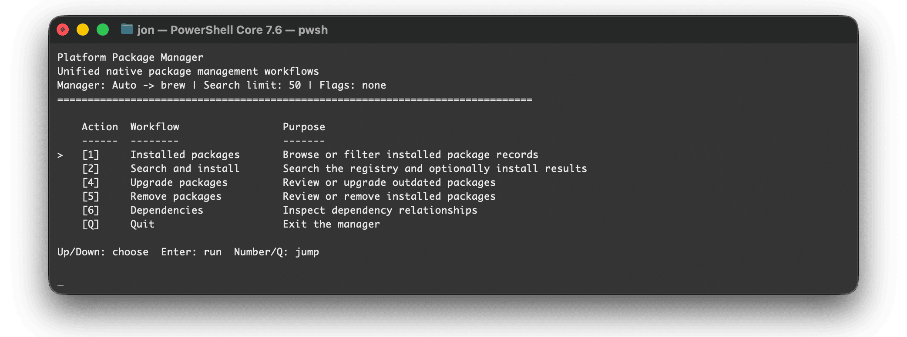
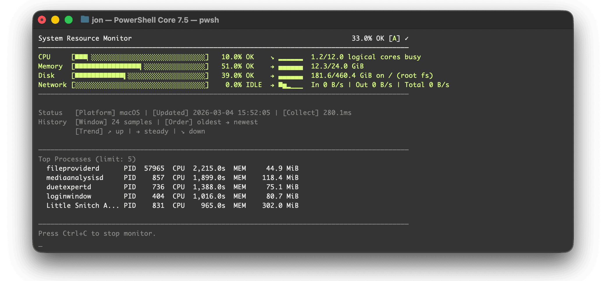
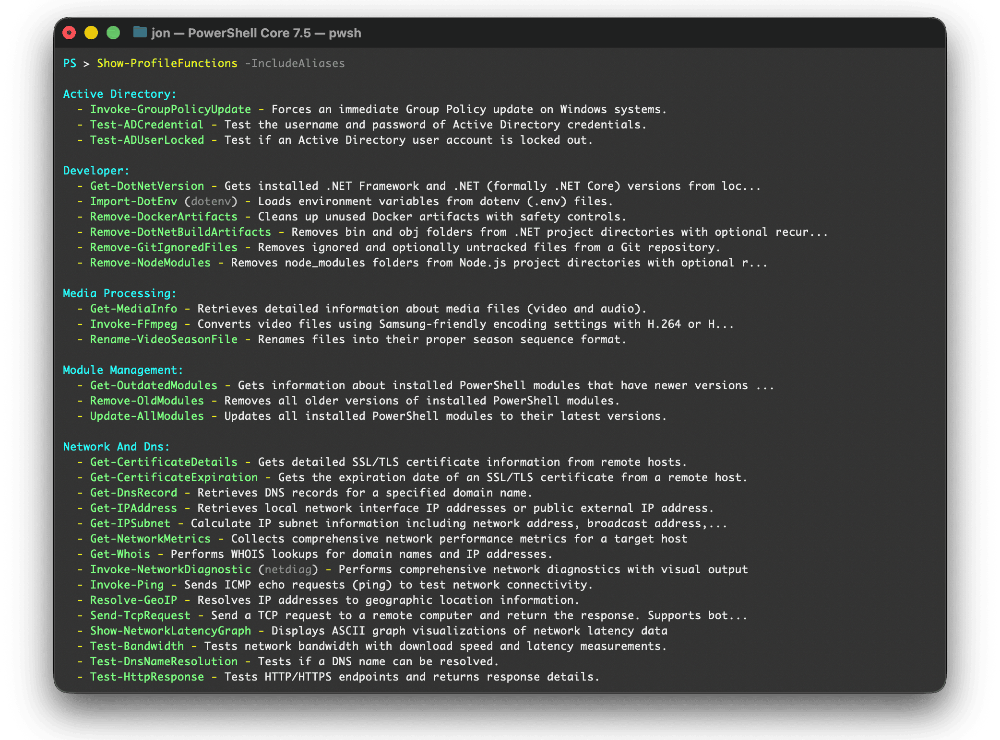

# PowerShell Profile

[](https://github.com/jonlabelle/pwsh-profile/actions/workflows/ci.yml)
[](https://github.com/jonlabelle/pwsh-profile/actions/workflows/codeql.yml)

> A modern, cross-platform PowerShell profile with auto-loading utility functions for network testing, system administration, and developer workflows.

This profile turns the PowerShell profile directory into a small, portable toolkit. Public functions under [`Functions`](./Functions/) are loaded automatically, machine-local helpers can live safely under [`Functions/Local`](./Functions/Local/), and the included prompt stays clean across Windows, macOS, and Linux.

## Highlights

- Works with Windows PowerShell Desktop 5.1+ and PowerShell 6+ (`pwsh`).
- Auto-loads public functions from categorized folders under [`Functions`](./Functions/).
- Preserves local-only profile content during install and update workflows.
- Includes focused tools for DNS, networking, TLS, package management, GitHub, Docker, media files, encoding, and everyday shell utilities.
- Keeps helper functions standalone-friendly, so individual `.ps1` files can be dot-sourced without loading the whole profile.

## Install

Prerequisites:

- PowerShell Desktop 5.1+ or PowerShell 6+ (`pwsh`)
- Internet access for the installer and update checks
- `git`, optional but recommended for `Update-Profile` and `Test-ProfileUpdate`

The installer backs up profile content it may replace, preserves local paths such as `Functions/Local`, `Help`, `Modules`, `PSReadLine`, `Scripts`, and `powershell.config.json` in place, then deploys the latest profile files.

Git is optional. When Git is unavailable, the installer downloads the repository zip from GitHub.

### PowerShell Core (X-Platform)

```powershell
irm 'https://raw.githubusercontent.com/jonlabelle/pwsh-profile/main/install.ps1' |
    pwsh -NoProfile -ExecutionPolicy Bypass -
```

### Windows PowerShell Desktop 5.1

```powershell
irm 'https://raw.githubusercontent.com/jonlabelle/pwsh-profile/main/install.ps1' |
    powershell -NoProfile -ExecutionPolicy Bypass -
```

Need custom paths, restore options, `-WhatIf`, or full clone history? See the [installation guide](docs/installation.md).

## Quick Start

After installation, open a new PowerShell session and try:

```powershell
# Browse everything the profile loaded
Show-ProfileFunction

# Search for the right command by keyword
Find-ProfileFunction dns

# Test network connectivity
Test-Port bing.com -Port 443

# Get public IP and geolocation details
Get-IPAddress -Public

# Check DNS and TLS
Test-DnsNameResolution github.com
Get-CertificateExpiration github.com

# Run a one-shot network diagnostic
Invoke-NetworkDiagnostic 'bing.com', 'microsoft.com' -MaxIterations 1
```

## Screenshots

### Invoke-NetworkDiagnostic

Runs network and DNS checks for multiple hosts, then renders live latency graphs.

```powershell
PS > 'www.google.com', 'www.cloudflare.com' |
    Invoke-NetworkDiagnostic -Port 80 -Interval 2 -IncludeDns
```



<details>
<summary><strong>Show-PlatformPackageManager</strong></summary>

Provides a unified interface for managing platform packages across winget, brew, apt, and apk.

```powershell
PS > Show-PlatformPackageManager
```



</details>

<details>
<summary><strong>Show-SystemResourceMonitor</strong></summary>

Displays a live monitor for CPU, memory, disk, network activity, and top processes.

```powershell
PS > Show-SystemResourceMonitor
```



</details>

<details>
<summary><strong>Show-ProfileFunction</strong></summary>

Lists all functions available in this profile, organized by category.

```powershell
PS > Show-ProfileFunction
```



</details>

## Documentation

Everything you need to know about installation, functions, troubleshooting, remoting, and contribution lives in the [docs](./docs/) folder:

- [Installation guide](docs/installation.md) - installer options, restore workflows, and manual fallback steps.
- [Function catalog](docs/functions.md) - every public function grouped by category.
- [Troubleshooting](docs/troubleshooting.md) - execution policy fixes and verbose profile loading.
- [Remote sessions](docs/remote-sessions.md) - loading profile functions inside PowerShell remoting sessions.
- [Local functions](Functions/Local/README.md) - local-only helper templates and conventions.
- [Tests](Tests/README.md) - test layout and contribution guidance.

## Function Areas

| Area                                                                | Includes                                                                                      |
| ------------------------------------------------------------------- | --------------------------------------------------------------------------------------------- |
| [Network and DNS](docs/functions.md#network-and-dns)                | DNS, ports, TLS checks, ping, traceroute, WHOIS, GeoIP, latency graphs                        |
| [System Administration](docs/functions.md#system-administration)    | permissions, elevation, TLS session settings, system info, package managers, resource monitor |
| [Developer](docs/functions.md#developer)                            | .NET, dotenv, Git, GitHub secrets/variables/topics, Docker, SQLFluff, Magika                  |
| [Utilities](docs/functions.md#utilities)                            | Base64, Markdown, slugs, encodings, file search, symbolic links, sync, archive extraction     |
| [Security](docs/functions.md#security)                              | JWT decoding, certificate inspection, password-based file protection                          |
| [Active Directory](docs/functions.md#active-directory)              | credentials, account lockout checks, group policy update                                      |
| [Module Management](docs/functions.md#powershell-module-management) | module update checks and cleanup                                                              |
| [Profile Management](docs/functions.md#profile-management)          | function discovery and profile update checks                                                  |
| [Media Processing](docs/functions.md#media-processing)              | ffprobe, FFmpeg conversion, image metadata inspection and stripping, season file renaming     |

## Local Functions

Place machine-specific helpers in [`Functions/Local`](./Functions/Local/). Files there load automatically with the rest of the profile, are ignored by Git, and are preserved by the installer and update workflow.

## Updating

Pull the latest profile changes with:

```powershell
Update-Profile
```

Check for updates without applying them:

```powershell
Test-ProfileUpdate
```

Both commands require Git. If Git is unavailable, rerun the install command to fetch the latest files.

## Standalone Use

Functions can be used without loading the whole profile by dot-sourcing the function file directly:

```powershell
PS > . 'Functions/NetworkAndDns/Test-Port.ps1'
PS > Test-Port bing.com -Port 443
```

Function dependencies are lazy-loaded by the function file when needed.

## Contributing

Contributions are welcome. Please keep changes aligned with the existing structure:

- One public function per `Functions/{Category}/Verb-Noun.ps1` file.
- Private helpers may live under category-specific `Private` folders.
- Include focused Pester coverage for new behavior.
- Keep functions cross-platform unless they are clearly platform-specific.
- Open a pull request with a short description and verification steps.

See the complete [contributing guide](CONTRIBUTING.md) for more details:

## Author

[@jonlabelle](https://github.com/jonlabelle)

## License

[MIT License](LICENSE)
