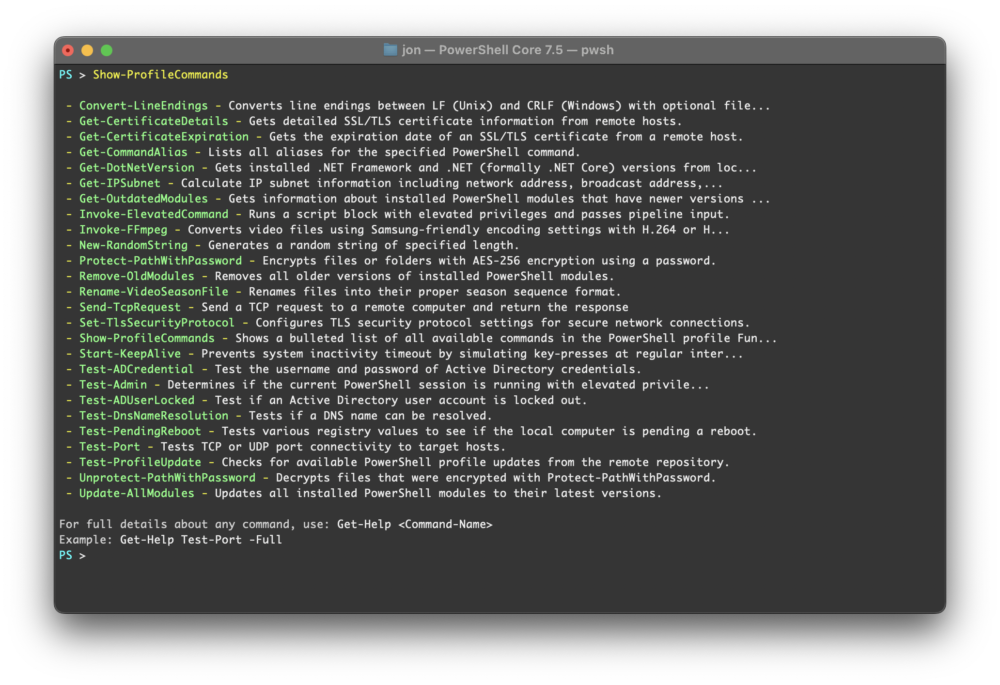

# PowerShell Profile

[](https://github.com/jonlabelle/pwsh-profile/actions/workflows/ci.yml)

> Cross-platform PowerShell profile with auto-loading utility functions for network testing, system administration, and developer workflows

## Install

~~Overlay~~ Overwrite your [PowerShell profile path](https://gist.github.com/jonlabelle/f2a4fdd989dbfe59e444e0beaf07bcc9) with the contents of this repository.

Choose your appropriate platform:

- [Linux/macOS](#linuxmacos)
- [Windows](#windows)
  - [PowerShell Desktop](#powershell-desktop)
  - [PowerShell Core](#powershell-core)

### Linux/macOS

```powershell
git clone 'https://github.com/jonlabelle/pwsh-profile.git' $HOME/.config/powershell
```

### Windows

#### PowerShell Desktop

```powershell
git clone 'https://github.com/jonlabelle/pwsh-profile.git' $HOME\Documents\WindowsPowerShell
```

#### PowerShell Core

```powershell
git clone 'https://github.com/jonlabelle/pwsh-profile.git' $HOME\Documents\PowerShell
```

## Features

- **Cross-platform compatibility** - Works on Windows, macOS, and Linux
- **Auto-loading functions** - All functions in the `Functions/` directory are automatically loaded
- **Automatic update notifications** - Background checks for profile updates without slowing startup
- **Custom prompt** - Clean, colored PowerShell prompt
- **Utility functions** - Collection of helpful PowerShell functions for daily tasks

## Screenshot



## Update

To manually pull in the latest updates from [this GitHub repo](https://github.com/jonlabelle/pwsh-profile):

```powershell
Update-Profile
```

## Automatic Update Checks

The profile [automatically checks for updates](./Functions/Test-ProfileUpdate.ps1) when it loads and will notify you if updates are available. The check runs in the background without slowing down your profile startup.

To disable automatic update checks, create an empty `.disable-update-check` file in your profile directory:

```powershell
# For Windows PowerShell Desktop
New-Item -Path "$HOME\Documents\WindowsPowerShell\.disable-update-check" -ItemType File

# For PowerShell Core
New-Item -Path "$HOME\Documents\PowerShell\.disable-update-check" -ItemType File
```
